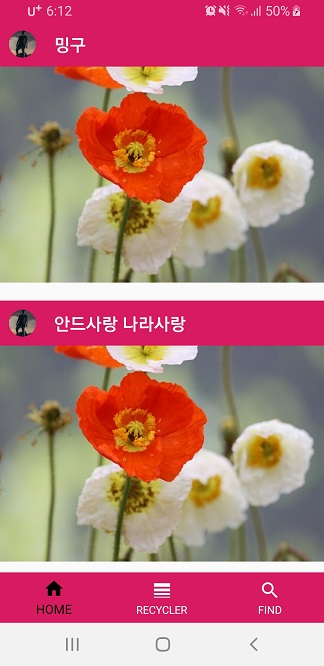

# 26th_SOPT

## 2주차 과제 실습 화면

- 필수 과제 화면

- 성장 과제 화면

웹툰처럼 디자인 하려 했으나 시간관계상 기존 아이템 재활용 후 Grid뷰로 사용

## itemDecoration
- RecyclerView 항목마다 Divider를 추가하거나 Padding을 넣기 위한 클래스

    

> itemDecoration을 상속받은 ItemDeco 클래스

~~~kotlin
class ItemDeco (context : Context, isGrid : Boolean = false, size : Int = 20) : RecyclerView.ItemDecoration()
{  
    private val size_space : Int  
    private val checking = isGrid  
  
    init
    {  
        size_space = dpToPx(context,size)  
    }  
  
    private fun dpToPx(context: Context, dp : Int): Int 
    {  
        return TypedValue.applyDimension(TypedValue.COMPLEX_UNIT_DIP, dp.toFloat(), context.resources.displayMetrics).toInt()  
    }  
  
    override fun getItemOffsets( outRect: Rect,view: View,parent: RecyclerView,state: RecyclerView.State  ) 
    {  
        super.getItemOffsets(outRect, view, parent, state)  
  
        when(checking){  
            false -> {  
                if(parent.getChildAdapterPosition(view) != state.itemCount - 1)
                {  
                    outRect.bottom = size_space  
                }  
            }  
  
            true ->{  
                val lp = view.layoutParams as GridLayoutManager.LayoutParams  
                // spanIndex -> 그리드 뷰 하나의 행의 순서  
				if (lp.spanIndex == 0)
				{  
                    outRect.left = size_space  
				    outRect.right = size_space / 2  
				}  
                else if( lp.spanIndex == lp.spanSize)
                {  
                    outRect.right = size_space  
					outRect.left = size_space / 2  
				}  
                else
                {  
                    outRect.left = size_space / 2  
				    outRect.right = size_space / 2  
			    }  
  
                outRect.bottom = size_space  
		    }  
	     }  
	}  
}
~~~

## clipToPadding

- 리사이클러 뷰 사용 시 스크롤 영역이 작아지는 것을 고려 해 스크롤 영역은 여백에 영향을 받지 않는 속성
- xml 코드에서 false로 설정 시 스크롤 영역은 그대로 유지 된다.
